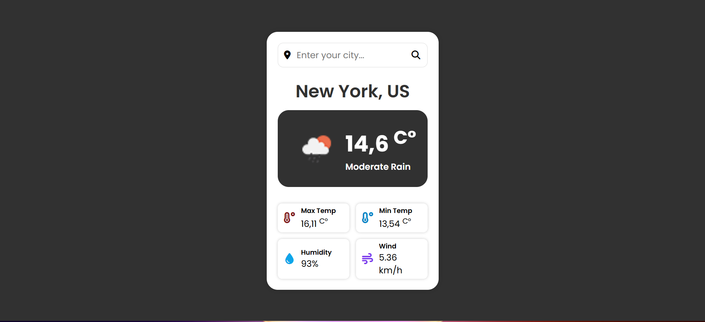
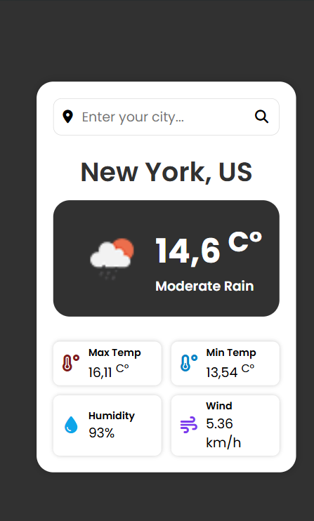
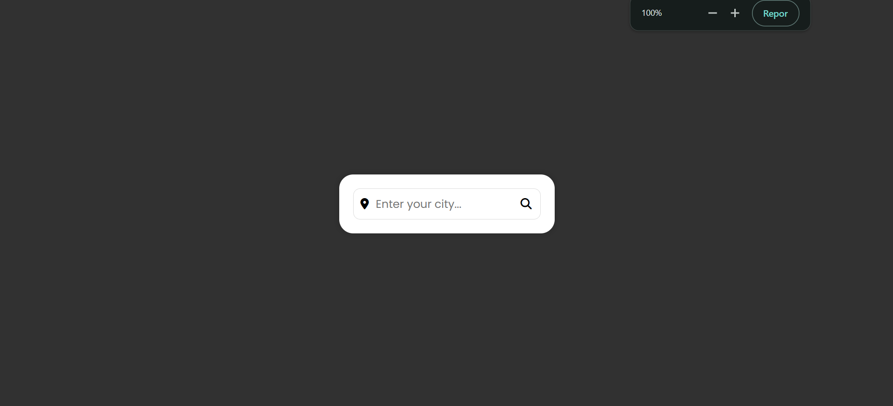
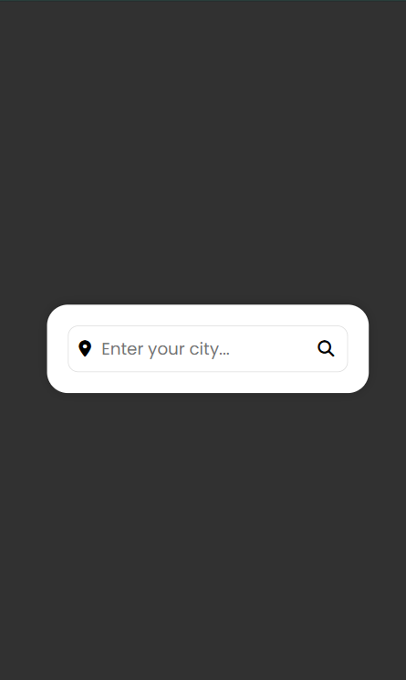

# Weather App

This project is a simple weather application built using React and Vite. It allows users to check the weather conditions of a specific city by entering the city name. The app is designed to be responsive, providing a consistent experience across different devices.

## Features

* **City Weather Forecast:** Users can enter the name of a city to retrieve its current weather information.
* **Weather Details:** The app displays various weather data, including:
    * Temperature
    * Climate/Conditions
    * Humidity
    * Wind speed
* **Responsive Design:** The application adapts to different screen sizes.

## Technologies Used

* React: A JavaScript library for building user interfaces.
* Vite: A build tool that aims to provide a faster and leaner development experience.
* OpenWeatherMap API: The application uses the OpenWeatherMap API to fetch weather data.

## Screenshots

**Mobile View - Empty State**

**Mobile View - Filled State**

**Desktop View - Empty State**

**Desktop View - Filled State**

## How to Use

1.  **Enter City Name:** In the input field, type the name of the city for which you want to check the weather.
2.  **Get Weather:** Press the search icon.
3.  **View Weather Details:** The application will display the current weather conditions for the specified city, including temperature, climate, humidity, and wind speed.

## Author
This simple Weather App was created by Arthur Granito.

## License

This project is open-source. Feel free to use and modify it according to your needs. (You can add a specific license here if you have one, e.g., MIT License).
